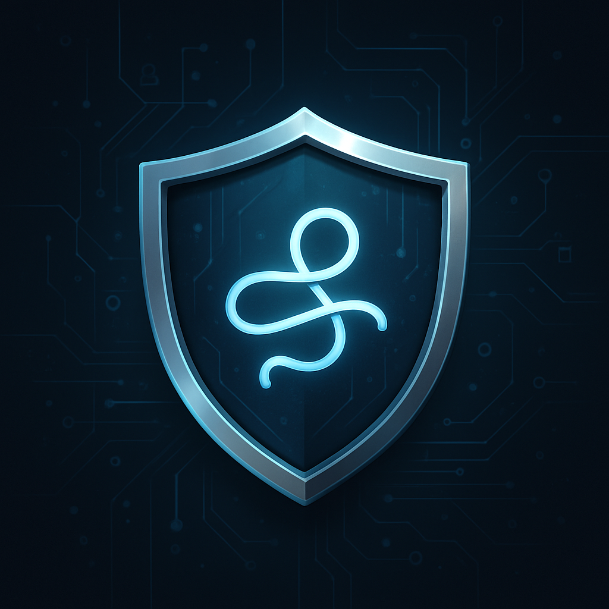
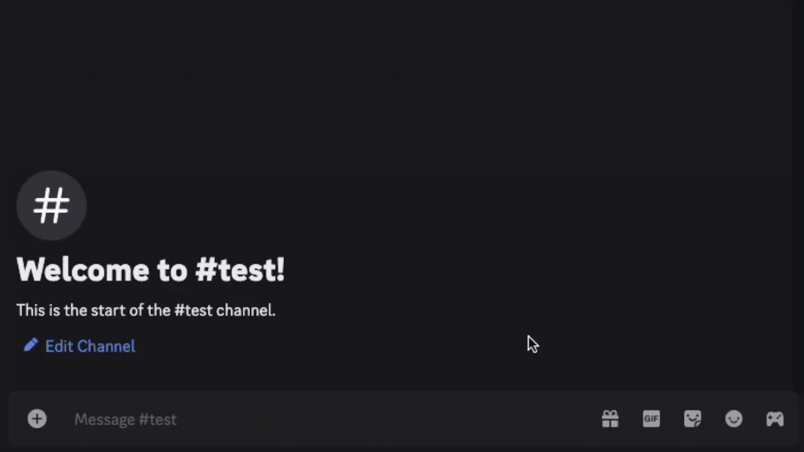
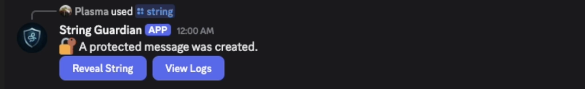
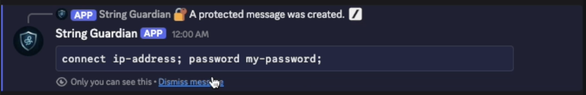
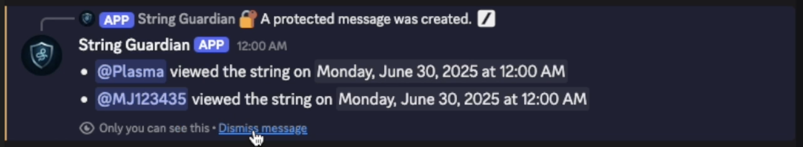

# 🛡️ String Guardian Discord Bot

<p align="center">
  
</p>

> **Helps moderators find trolls while keeping connection info or passwords public.**

**String Guardian** is a serverless Discord bot that protects sensitive messages (like game server connection strings or passwords) behind a reveal button. It also logs which users accessed the message.

This bot is ideal for **pickup game (PUG) servers** or any community where:
- You want to post connection info in a public channel
- You need to track which Discord members viewed it
- You want to take action against trolls, harassers, or DDoSers

## 🎥 Demo



## 📌 Usage

Create a protected string message using the slash command:

```bash
/string "connect ip-address; password my-password;"
```

This will send a message to the channel.



### 🔓 Reveal Button

When a user clicks the **Reveal String** button:
- Logs the user's ID + timestamp
- Sends the string to the user as an **ephemeral message** (only the user can view)



### 📜 View Logs Button

When a user clicks the **View Logs** button:
- Sends the user an **ephemeral message** listing everyone who viewed the string and when



## 🚀 Installation (for server admins)

To add **String Guardian** to your Discord server:

️<br>

👉 [**Click here to invite the bot**](https://discord.com/oauth2/authorize?client_id=1387414117106581625) 👈

️<br>

## 🛠️ Development Setup

️<br>

<details>

Ensure that the Discord bot is created on the Discord developer portal.

First, create secret/env variables in `.dev.vars`.
For local development, Cloudflare variables are not required.

Register the Discord commands using the registration script:
```bash
npm run register
```

Install and run local development server:
```bash
npm install
npm run dev
```

Reset (& run migrations) for the local D1 development database:
```bash
npm run db:reset
```

Ensure Ngrok is installed and run it to provide a reverse proxy to access your
locally-running bot:
```bash
ngrok 8787
```

Copy the global URL and paste it into the "Interactions URL" input for your App
in the Discord developer portal.

You can now install the bot onto a Discord server and test your locally-running code.

</details>

️<br>

## License

MIT
