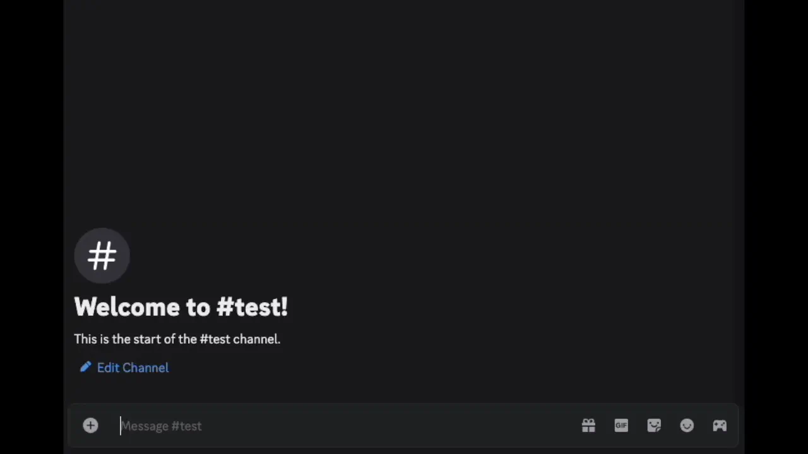
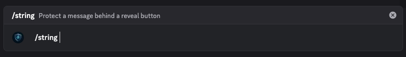
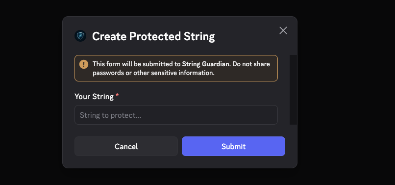
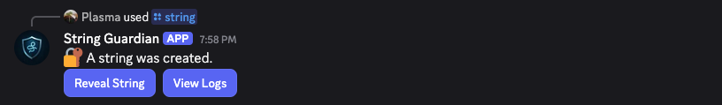
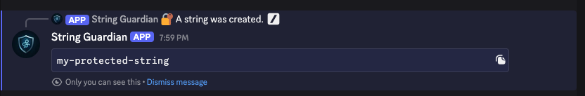
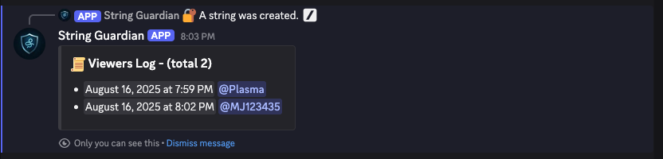

# 🛡️ String Guardian Discord Bot

<p align="center">
  
</p>

<p align="center"><b>Protects sensitive strings and logs access in Discord</b></p>

**String Guardian** is a serverless Discord bot that protects sensitive messages (like server IPs, connection strings or passwords) behind a reveal button, with logging to track who accessed them.

👉 [**Add String Guardian to your server**](https://discord.com/oauth2/authorize?client_id=1387414117106581625)

**✨ Features:**
- 🔐 Protect sensitive messages behind a reveal button
- 👁️ Track who viewed your strings, with timestamps
- ⚡ Simple /string command for posting protected content
- 🔔 Optional role pings to alert the right users
- 🛡️ Useful for PUG discord servers, game servers, or community moderation

**🎯 Use cases:**
- 🎮 Perfect for for **pickup game (PUG)** servers or any community that wants to share connection info
in **public channels** while tracking which members access it — making it easier to handle trolls,
harassers, or DDoSers.

## 🎥 Demo



## 📌 Usage

**How it works:**
1. Use `/string` to create a protected message
2. Members click **Reveal String** to see it (ephemeral)
3. Moderators click **View Logs** to see who revealed it

### 🧶 Creating a String

Create a protected string message using the `/string` command:



And entering your string content into the form:



This will send a message to the channel.



### 🔓 Reveal Button

When a user clicks the **Reveal String** button:
- The user ID and timestamp is logged
- An **ephemeral message** is sent to the user containing the string (only the user can see it)



### 📜 View Logs Button

When a user clicks the **View Logs** button:
- An **ephemeral message** is sent to the user containing a list of every Discord user who viewed the string and the timestamp



## 🚀 Installation (for server admins)

Add **String Guardian** to your Discord server:

👉 [**Click here to invite the bot**](https://discord.com/oauth2/authorize?client_id=1387414117106581625)

**Privacy Disclaimer:** *This bot stores data such as **Discord IDs**, **timestamps**, and **submitted string content**. Data will not be shared unless required for legal compliance. Data may be deleted at any time at the discretion of the bot owner.*

## 🛠️ Development Setup

<details>
<summary>Local Development</summary>

Ensure that the Discord bot is created on the Discord developer portal.

Create `.dev.vars` and fill the variables as per `.dev.vars.example` using
information from the Discord developer portal.

Install NPM dependencies:
```bash
npm install
```

Register the Discord commands using the registration script:
```bash
npm run register
```

Install and run local development server:
```bash
npm run dev
```

Reset (& run migrations) for the local D1 development database:
```bash
npm run db:reset
```

Ensure Ngrok is installed and run it to provide a reverse proxy to access your
locally-running bot:
```bash
ngrok http 8787
```

Copy the global URL from the Ngrok console and paste it into the
"Interactions URL" input field for your App in the Discord developer portal.

You can now install the bot onto a Discord server and test your locally-running code.

</details>

<details>
<summary>Deployment</summary>

To ensure that the CICD deployment pipeline works, ensure that the following secrets are
configured under **Settings > Secrets and variables > Actions**:
settings are configured:
- `CLOUDFLARE_API_TOKEN`
- `CLOUDFLARE_ACCOUNT_ID`

To ensure that the deployed Cloudflare Worker has the environment variables required for operation,
ensure that the following secrets are configured under **Settings > Variables and Secrets**:
- `APP_ID`
- `BOT_TOKEN`
- `PUBLIC_KEY`


</details>

## License

[MIT](LICENSE)
